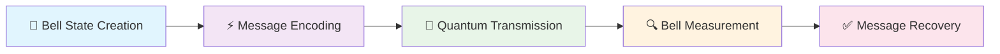

# 🌌 Quantum Superdense Coding Simulator

<div align="center">


<div align="c| 👤 **T|----| 👤 **Tea| **| **| **G. Sai Pradhun** | 🏗️ Project Architect | System Architecture & Technical Design |
| **Sri Vyshnavi Chepuri** | 🎨 UX Research & Testing | User Experience & Visual Appeal Assessment |  
| **Beshwanth Sai Katari** | 🔬 Research Specialist | Research & Analysis |
| **Sahithi Pasam** | 🧪 Quality Assurance | System Testing & Vulnerability Detection |
| **Harshitha Koppuravuri** | 🔍 Test Engineer | Comprehensive Testing & Quality Validation |i Pradhun** | 🏗️ Project Architect | System Architecture & Technical Design |
| **Sri Vyshnavi Chepuri** | 🎨 UX Research & Testing | User Experience & Visual Appeal Assessment |  
| **Beshwanth Sai Katari** | 🔬 Research Specialist | Research & Analysis |
| **Sahithi Pasam** | 🧪 Quality Assurance | System Testing & Vulnerability Detection |
| **Harshitha Koppuravuri** | 🔍 Test Engineer | Comprehensive Testing & Quality Validation |i Pradhun** | 🏗️ Project Architect | System Architecture & Technical Design |
| **Sri Vyshnavi Chepuri** | 🎨 UX Research & Testing | User Experience & Visual Appeal Assessment |  
| **Beshwanth Sai Katari** | 🔬 Research Specialist | Research & Analysis |
| **Sahithi Pasam** | 🧪 Quality Assurance | System Testing & Vulnerability Detection |
| **Harshitha Koppuravuri** | 🔍 Test Engineer | Comprehensive Testing & Quality Validation |ber** | 🎯 **Role** | 💫 **Contribution** |
|--------------------|-------------|---------------------|
| **Gourishetti Ruthvik** | 🚀 Lead Developer | Core Development & Implementation Leadership |
| **G. Sai Pradhun** | 🏗️ Project Architect | System Architecture & Technical Design |
| **Sri Vyshnavi Chepuri** | 🎨 UX Research & Testing | User Experience & Visual Appeal Assessment |  
| **Beshwanth Sai Katari** | 🔬 Research Specialist | Research & Analysis |
| **Sahithi Pasam** | 🧪 Quality Assurance | System Testing & Vulnerability Detection |
| **Harshitha Koppuravuri** | 🔍 Test Engineer | Comprehensive Testing & Quality Validation |--------|-------------|---------------------|
| **Gourishetti Ruthvik** | 🚀 Lead Developer | Core Development & Implementation Leadership |
| **G. Sai Pradhun** | 🏗️ Project Architect | System Architecture & Technical Design |
| **Sri Vyshnavi Chepuri** | 🎨 UX Research & Testing | User Experience & Visual Appeal Assessment |  
| **Beshwanth Sai Katari** | 🔬 Research Specialist | Research & Analysis |
| **Sahithi Pasam** | 🧪 Quality Assurance | System Testing & Vulnerability Detection |
| **Harshitha Koppuravuri** | 🔍 Test Engineer | Comprehensive Testing & Quality Validation |ber** | 🎯 **Role** | 💫 **Contribution** |
|--------------------|-------------|---------------------|
| **Gourishetti Ruthvik** | 🚀 Lead Developer | Core Development & Implementation Leadership |
| **G. Sai Pradhun** | 🏗️ Project Architect | System Architecture & Technical Design |
| **Sri Vyshnavi Chepuri** | 🎨 UX Research & Testing | User Experience & Visual Appeal Assessment |  
| **Beshwanth Sai Katari** | 🔬 Research Specialist | Research & Analysis |
| **Sahithi Pasam** | 🧪 Quality Assurance | System Testing & Vulnerability Detection |
| **Harshitha Koppuravuri** | 🔍 Test Engineer | Comprehensive Testing & Quality Validation |

| 👤 **Team Member** | 🎯 **Role** | 💫 **Contribution** |
|--------------------|-------------|---------------------|
| **Gourishetti Ruthvik** | 🚀 Lead Developer | Core Development & Implementation Leadership |
| **G. Sai Pradhun** | 🏗️ Project Architect | System Architecture & Technical Design |
| **Sri Vyshnavi Chepuri** | 🎨 UX Research & Testing | User Experience & Visual Appeal Assessment |  
| **Beshwanth Sai Katari** | 🔬 Research Specialist | Research & Analysis |
| **Sahithi Pasam** | 🧪 Quality Assurance | System Testing & Vulnerability Detection |
| **Harshitha Koppuravuri** | 🔍 Test Engineer | Comprehensive Testing & Quality Validation |

</div>tps://img.shields.io/badge/Qiskit-6929C4?style=for-the-badge&logo=qiskit&logoColor=white)

**🚀 A professional, interactive Streamlit application for simulating, visualizing, and analyzing the quantum superdense coding protocol**

*Comprehensive platform for researchers, educators, and students featuring an engaging cosmic-themed interface, real-time analytics, and advanced quantum cryptography capabilities*

</div>

---

---

## 📋 Table of Contents

- [🌟 Overview](#-overview)
- [✨ Features](#-features)
- [⚡ How It Works](#-how-it-works)
- [📁 Project Structure](#-project-structure)
- [🚀 Installation](#-installation)
- [💻 Usage](#-usage)
- [🔬 Technical Details](#-technical-details)
- [🌍 Real-World Applications](#-real-world-applications)
- [📦 Requirements](#-requirements)
- [📄 License](#-license)
- [👥 Authors](#-authors)
- [📚 References](#-references)

---

## 🌟 Overview

> **Superdense coding** is a quantum communication protocol that enables the transmission of **two classical bits** of information by sending only **one qubit**, provided that the sender and receiver share an entangled pair.

<div align="center">



</div>

🎯 **Why This Simulator?**
- 📊 **Hands-on Learning**: Visual environment to understand quantum communication principles
- 🔬 **Research Tool**: Comprehensive analysis of quantum noise effects and security monitoring
- 🎨 **Engaging Interface**: Modern cosmic-themed UI that enhances the learning experience
- 🛡️ **Security Analysis**: Advanced cryptographic features and eavesdropping detection

The application features a **modern cosmic-themed interface** that enhances the user experience while maintaining focus on the core quantum communication principles.

---

## ✨ Features

<div align="center">

| 🎯 **Core Capabilities** | 🎨 **Visualizations** | 🔒 **Security & Analytics** |
|---------------------------|------------------------|------------------------------|
| Full Protocol Simulation | 3D Bloch Sphere Views | CHSH Inequality Monitoring |
| Cosmic-Themed Interface | Quantum Circuit Diagrams | Cryptography Dashboard |
| Real-time Analytics | State Evolution Charts | Random Number Analysis |
| Multiple Input Methods | Performance Dashboards | Eavesdropping Detection |

</div>

### 🚀 **Full Protocol Simulation**
- ⚡ Complete step-by-step execution of the superdense coding protocol
- 🔮 Bell state creation, message encoding, and quantum channel transmission
- 📊 Real-time visualization and comprehensive decoding analysis

### 🎨 **Interactive Cosmic-Themed Interface**
- 🌌 Modern, engaging UI with cosmic visual effects and animations
- 🎛️ Multiple message input methods: manual bit selection, text-to-binary conversion, or real-world scenario presets
- ⚙️ Configurable quantum channel noise and security monitoring options
- 📈 Multiple visualization modes: standard view, detailed analysis, or real-time animation

### 🌐 **Advanced Quantum Visualizations**
- 🪐 **3D Bloch Sphere** representations of quantum states
- 🔄 **Quantum Circuit Diagrams** showing protocol steps
- 📊 **State Evolution** and measurement distribution charts
- ⚡ **Real-time Protocol** performance analytics

### 📊 **Comprehensive Analytics Dashboard**
- 📈 Track protocol fidelity, error rates, and success rates over time
- 🎯 Communication efficiency analysis (classical vs. quantum advantage)
- ⚖️ Protocol balance testing across all possible bit combinations
- 🏆 Session performance metrics and historical data

### 🛡️ **Security & Cryptography Features**
- 🔐 **CHSH Inequality** monitoring for eavesdropping detection
- 🔑 **Quantum Cryptography** analysis dashboard
- 📡 **Channel Security** indicators and quality assessments
- 🎲 **Quantum Random Number** generation analysis

### 🎓 **Educational & Research Tools**
- 📖 Technical specifications and protocol documentation
- 🌍 Real-world application scenarios (healthcare, finance, IoT)
- 🧪 Testing and validation tools for protocol verification
- 📊 Comprehensive performance benchmarking

---

## ⚡ How It Works

<div align="center">

```
🌟 Alice & Bob share entangled qubits
           ↓
⚡ Alice encodes 2-bit message using quantum gates
           ↓
📡 Alice sends 1 qubit through quantum channel
           ↓
🔍 Bob performs Bell measurement on both qubits
           ↓
✅ Bob recovers Alice's original 2 bits
```

**🎯 Quantum Advantage: 2 bits transmitted using only 1 qubit!**

</div>

### 📋 **Protocol Steps**

| Step | 🎭 **Actor** | 🎯 **Action** | 🔬 **Quantum Operation** |
|------|-------------|---------------|---------------------------|
| 1️⃣ | 🤝 Both | **Entanglement** | Create Bell state \|Φ⁺⟩ |
| 2️⃣ | 👩 Alice | **Encoding** | Apply I, X, Z, or XZ gates |
| 3️⃣ | 👩 Alice | **Transmission** | Send qubit through quantum channel |
| 4️⃣ | 👨 Bob | **Decoding** | Perform Bell measurement |
| 5️⃣ | 🔍 System | **Analysis** | Compare sent vs received bits |
| 6️⃣ | 🛡️ Security | **Monitoring** | Check for eavesdropping via CHSH |

---

## 📁 Project Structure

```
🌌 decoding_superdense_coding/
│
├── 🚀 app.py                     # Main Streamlit app with cosmic-themed UI
├── ⚛️ quantum_protocol.py       # Core superdense coding implementation  
├── 🛠️ utils.py                   # Visualization tools & analytics suite
├── 📦 requirements.txt           # Python dependencies & packages
├── 📖 README.md                  # Comprehensive project documentation
├── 🧪 test_quantum_crypto.py     # Quantum cryptography testing
├── 🎨 test_quantum_viz.py        # Visualization testing & QA
├── 📝 test_text_analysis.py      # Text analysis & encoding testing
└── 🗂️ __pycache__/               # Python cache files
```

### 🔧 **Key Components**

<div align="center">

| 📄 **File** | 🎯 **Purpose** | 🌟 **Key Features** |
|-------------|----------------|---------------------|
| `app.py` | 🖥️ Main Interface | Cosmic UI, Protocol Controls, Analytics |
| `quantum_protocol.py` | ⚛️ Core Engine | Quantum Simulation, Noise Modeling, Security |
| `utils.py` | 🎨 Visualization | Bloch Spheres, Circuit Diagrams, Performance Charts |
| `test_*.py` | 🧪 Quality Assurance | Protocol Accuracy, Visualization Quality |

</div>

---

## 🚀 Installation

<div align="center">

**🎯 Quick Start Guide - Get Running in 5 Minutes!**

</div>

### 1️⃣ **Clone the Repository**
```bash
git clone https://github.com/gourishetti-ruthvik/decoding_superdense_coding.git
cd decoding_superdense_coding
```

### 2️⃣ **Create Virtual Environment** *(Recommended)*

<details>
<summary><b>🪟 Windows</b></summary>

```bash
python -m venv venv
venv\Scripts\activate
```
</details>

<details>
<summary><b>🐧 macOS/Linux</b></summary>

```bash
python3 -m venv venv
source venv/bin/activate
```
</details>

### 3️⃣ **Install Dependencies**
```bash
pip install -r requirements.txt
```

### 4️⃣ **Launch the Simulator**
```bash
streamlit run app.py
```

### 5️⃣ **Open in Browser** 🌐
Visit the local URL provided by Streamlit *(typically [http://localhost:8501](http://localhost:8501))*

<div align="center">

🎉 **You're ready to explore quantum superdense coding!** 🎉

</div>
   
---

## 💻 Usage

### 🎮 **Getting Started**

1. **🚀 Launch the Application**
   ```bash
   streamlit run app.py
   ```

2. **🌐 Open in Browser**  
   Navigate to [http://localhost:8501](http://localhost:8501)

3. **🎯 Explore the Simulator**

<div align="center">

| 🎛️ **Configuration** | 💭 **Input Methods** | 📊 **Analysis** |
|----------------------|----------------------|------------------|
| Adjust noise levels | Manual bit selection | View quantum states |
| Enable security monitoring | Text-to-binary conversion | Analyze performance |
| Select visualization modes | Application scenarios | Security assessment |

</div>

### 🎯 **Feature Walkthrough**

- **⚙️ Protocol Configuration**: Use the sidebar to adjust quantum channel noise levels, enable security monitoring, and select visualization modes
- **💭 Message Input**: Choose from manual bit selection, text-to-binary conversion, or predefined application scenarios
- **▶️ Execute Protocol**: Run the superdense coding protocol with real-time visualization and analysis
- **📊 Analyze Results**: Examine quantum state visualizations, performance metrics, and security assessments
- **🎨 Advanced Features**: Access 3D Bloch sphere visualizations, quantum circuit diagrams, and cryptography dashboards
- **🧪 Testing Tools**: Use protocol balance testing and session analytics for comprehensive analysis

<div align="center">

**🎓 Perfect for students, researchers, and quantum computing enthusiasts!**

</div>

---

## Technical Details

- **Quantum Protocol Implementation:**  
  - Advanced quantum circuit simulation using Qiskit (with classical fallback)
  - Realistic noise modeling including depolarizing and Pauli error channels
  - High-fidelity Bell state preparation and measurement protocols
  - Comprehensive protocol step tracking and performance monitoring

- **Quantum State Visualization:**  
  - Interactive 3D Bloch sphere representations of quantum states
  - Real-time quantum circuit diagram generation
  - State evolution tracking throughout protocol execution
  - Bell state encoding visualization for all bit combinations

- **Noise & Error Analysis:**  
  - Configurable quantum channel noise levels (0-50% error rates)
  - Real-time channel quality assessment and recommendations
  - Error rate analysis and protocol fidelity measurements
  - Adaptive noise modeling for realistic quantum communication scenarios

- **Security & Cryptography:**  
  - CHSH inequality violation testing for eavesdropping detection
  - Quantum key distribution analysis and entropy measurements
  - Security level gauges and threat assessment indicators
  - Quantum random number generation validation

- **User Interface & Experience:**  
  - Modern cosmic-themed interface with smooth animations
  - Responsive design with interactive visualizations using Plotly
  - Real-time performance dashboards and analytics
  - Comprehensive testing and validation tools

- **Performance Analytics:**  
  - Session-based performance tracking and historical analysis
  - Protocol balance testing across all 4 possible bit combinations
  - Communication efficiency analysis (2x quantum advantage demonstration)
  - Detailed measurement statistics and validation reports

---

## 🌍 Real-World Applications

The superdense coding protocol simulated in this application has significant implications across multiple industries:

<div align="center">

| 🏥 **Healthcare** | 💰 **Financial** | 🏭 **IoT & Industry** | 🛡️ **Security** |
|-------------------|-------------------|------------------------|------------------|
| Patient Data Security | Quantum-Safe Transactions | Smart Grid Control | Government Communications |
| Medical IoT Devices | HFT Communications | Industrial Automation | Military Networks |
| Emergency Protocols | Digital Identity | Sensor Networks | Diplomatic Channels |
| Telemedicine Platforms | Blockchain Security | Supply Chain Tracking | National Infrastructure |

</div>

### 🏥 **Healthcare & Medical**
- 🩺 **Secure Patient Data** transmission between hospitals
- 🔗 **IoT Medical Device** authentication and monitoring  
- 🚨 **Emergency Alert** protocols with quantum-enhanced security
- 💻 **Telemedicine Platforms** with post-quantum cryptography

### 💰 **Financial Services**
- 💳 **Quantum-Safe Financial** transaction processing
- 📈 **High-Frequency Trading** with ultra-secure communications
- 🆔 **Digital Identity** verification and authentication systems
- ⛓️ **Blockchain & Cryptocurrency** security enhancements

### 🏭 **Internet of Things (IoT)**
- ⚡ **Smart Grid** control and energy distribution security
- 🏭 **Industrial Automation** with tamper-proof communications
- 🌡️ **Authenticated Sensor** networks and environmental monitoring
- 📦 **Supply Chain** tracking with quantum-verified integrity

### 🛡️ **Government & Defense**
- 🏛️ **Secure Government** communications and diplomatic channels
- 🎖️ **Military Communication** networks with quantum encryption
- 🔒 **National Security** infrastructure protection
- 🌐 **International Cooperation** on quantum communication standards

### 🎓 **Research & Academia**
- 🌐 **Quantum Internet** development and testing
- 📚 **Educational Tools** for quantum information science
- 🤝 **Research Collaboration** with secure data sharing
- 🧪 **Protocol Validation** and benchmarking studies

---

## 📦 Requirements

<div align="center">


</div>

See [`requirements.txt`](requirements.txt) for the complete dependency list.

### 🎯 **Core Dependencies**

| 📦 **Package** | 🔧 **Purpose** | 📊 **Importance** |
|----------------|----------------|-------------------|
| `streamlit` | 🖥️ Web application framework |  |
| `qiskit` | ⚛️ Quantum computing framework |  |
| `qiskit-aer` | 🔬 Quantum circuit simulator |  |
| `plotly` | 📊 Interactive visualizations |  |
| `pandas` | 📈 Data analysis & manipulation |  |
| `numpy` | 🔢 Numerical computing |  |

### 🛠️ **Additional Libraries**
- `hashlib` - 🔐 Cryptographic hashing for text-to-bits conversion
- `time` - ⏱️ Performance timing and execution monitoring  
- `random` - 🎲 Quantum randomness simulation and noise modeling

### 🐍 **Python Version**
**Python 3.8+** recommended for optimal performance and compatibility

---

## License

This project is for educational and demonstration purposes only.  
Feel free to use, modify, and share for non-commercial and academic purposes.

---

## 👥 Authors

<div align="center">

**🌟 Quantum Superdense Coding Simulator Development Team 🌟**

</div>

<div align="center">

| 👤 **Team Member** | 🎯 **Role** | 💫 **Contribution** |
|--------------------|-------------|---------------------|
| **Gourishetti Ruthvik** | 🚀 Lead Developer | Core Development & Implementation Leadership |
| **G. Sai Pradhun** | 🏗️ Project Architect | System Architecture & Technical Design |
| **Sri Vyshnavi Chepuri** | 🎨 UX Research & Testing | User Experience & Visual Appeal Assessment |  
| **Beshwanth Sai Katari** | �️ Research Specialist | Research & Analysis |
| **Sahithi Pasam** | 🧪 Quality Assurance | System Testing & Vulnerability Detection |
| **Harshitha Koppuravuri** | � Test Engineer | Comprehensive Testing & Quality Validation |

</div>

---

<div align="center">

**🔗 Project Repository**

[](https://github.com/gourishetti-ruthvik/decoding_superdense_coding)

**💬 Get Involved**

[](https://github.com/gourishetti-ruthvik/decoding_superdense_coding/issues)
[](https://github.com/gourishetti-ruthvik/decoding_superdense_coding/pulls)
[](https://github.com/gourishetti-ruthvik/decoding_superdense_coding/discussions)

</div>

For questions, contributions, or collaboration opportunities, please open an issue or submit a pull request on GitHub!

---

## 📚 References

<div align="center">

**📖 Comprehensive Resource Collection**

</div>

### 🔬 **Quantum Computing & Communication**
- 📝 [**Superdense Coding - Wikipedia**](https://en.wikipedia.org/wiki/Superdense_coding)
- 📚 [**Quantum Communication - IBM Qiskit Textbook**](https://qiskit.org/textbook/ch-algorithms/quantum-key-distribution.html)
- 🔗 [**Bell States and Entanglement**](https://en.wikipedia.org/wiki/Bell_state)
- 🌐 [**Quantum Internet Alliance**](https://quantum-internet.team/)

### 📋 **Technical Documentation**
- ⚛️ [**Qiskit Documentation**](https://qiskit.org/documentation/)
- 🖥️ [**Streamlit Documentation**](https://docs.streamlit.io/)
- 📊 [**Plotly Documentation**](https://plotly.com/python/)
- 🐍 [**Python Quantum Computing**](https://github.com/qiskit-community/awesome-qiskit)

### 📄 **Academic Papers & Research**

| 📖 **Paper** | 👨‍🔬 **Authors** | 📅 **Year** | 🔗 **Link** |
|--------------|------------------|-------------|-------------|
| Communication via one- and two-particle operators on Einstein-Podolsky-Rosen states | Bennett, C.H. & Wiesner, S.J. | 1992 | [📄 Physical Review Letters](https://journals.aps.org/prl/abstract/10.1103/PhysRevLett.69.2881) |
| Quantum Computation and Quantum Information | Nielsen, M.A. & Chuang, I.L. | 2010 | [📚 Cambridge University Press](https://www.cambridge.org/core/books/quantum-computation-and-quantum-information/01E10196D0A682A6AEFFEA52D53BE9AE) |
| Teleporting an unknown quantum state via dual classical and Einstein-Podolsky-Rosen channels | Bennett, C.H. et al. | 1993 | [📄 Physical Review Letters](https://journals.aps.org/prl/abstract/10.1103/PhysRevLett.70.1895) |
| Quantum cryptography based on Bell's theorem | Ekert, A.K. | 1991 | [📄 Physical Review Letters](https://journals.aps.org/prl/abstract/10.1103/PhysRevLett.67.661) |

### 🔐 **Security & Cryptography Resources**
- 🔒 [**CHSH Inequality and Bell's Theorem**](https://en.wikipedia.org/wiki/CHSH_inequality)
- 🛡️ [**Post-Quantum Cryptography - NIST**](https://csrc.nist.gov/projects/post-quantum-cryptography)
- 🔐 [**Quantum Cryptography Research - arXiv**](https://arxiv.org/list/quant-ph/recent)
- 🌐 [**European Quantum Flagship**](https://qt.eu/)

### 🎓 **Educational Resources**
- 🎯 [**Microsoft Quantum Development Kit**](https://azure.microsoft.com/en-us/products/quantum)
- 📚 [**Quantum Computing: An Applied Approach**](https://www.springer.com/gp/book/9783030239213)
- 🎥 [**Quantum Computing Explained - YouTube**](https://www.youtube.com/results?search_query=quantum+computing+explained)
- 🏫 [**MIT OpenCourseWare - Quantum Information Science**](https://ocw.mit.edu/courses/8-370x-quantum-information-science-i-spring-2018/)

---

<div align="center">

*📅 Last Updated: August 28, 2025*

**🌟 Made with ❤️ by the Quantum Computing Community**

[](https://github.com/gourishetti-ruthvik/decoding_superdense_coding)

</div>
